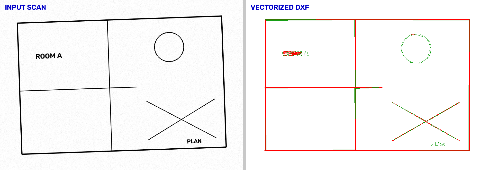

# scan2dwg

Convert **raster scans of 2D drawings** (images or scanned PDFs) into editable
CAD geometry — **DXF** out of the box, and **DWG** when a converter is
installed.

It's a raster-to-vector pipeline aimed at things like scanned floor plans,
site drawings, schematics, and marked-up prints: it cleans the scan, traces the
lines and shapes into CAD entities, optionally reads the text via OCR, and
writes a layered DXF that opens in AutoCAD and every other major CAD tool.



> **Scope note.** This handles **2D raster** scans. It does *not* process 3D
> laser-scan point clouds (LAS/E57/PTS) — that's a different problem and a
> possible future module. See [Roadmap](#roadmap).

## Why DXF (and how DWG works)

DWG is Autodesk's proprietary binary format; there is no pure-Python writer.
The reliable path everyone uses is:

```
scan  ─▶  DXF (open, fully documented, read by all CAD tools)  ─▶  DWG (optional)
```

`scan2dwg` always writes DXF. If you also pass `--dwg`, it converts DXF→DWG
using an external backend if one is installed (ODA File Converter or LibreDWG).
For most workflows the DXF is all you need — AutoCAD opens and re-saves it as
DWG natively.

## Install

```bash
pip install -e .            # core: images -> DXF
pip install -e '.[pdf]'     # + scanned-PDF input  (PyMuPDF)
pip install -e '.[ocr]'     # + text recognition   (needs the tesseract binary)
pip install -e '.[all,dev]' # everything + test deps
```

For DWG output, install one of:
- [ODA File Converter](https://www.opendesign.com/guestfiles/oda_file_converter) (free) — recommended
- [LibreDWG](https://www.gnu.org/software/libredwg/) (`dxf2dwg`)

## Usage

```bash
# Simplest: image in, DXF out (alongside the input)
scan2dwg drawing.png

# Choose output, skip OCR, also emit DWG
scan2dwg drawing.tif -o out.dxf --no-ocr --dwg

# Scanned PDF (each page -> out_p1.dxf, out_p2.dxf, ...)
scan2dwg plans.pdf -o plans.dxf --pdf-dpi 400

# Real-world scale: if 1 pixel == 5 mm
scan2dwg plan.png --scale 5.0
```

Key flags: `--scale` (drawing units per pixel), `--no-deskew`,
`--min-line-length` (detail vs. noise trade-off), `--pdf-dpi`, `--no-ocr`,
`--dwg`. Run `scan2dwg --help` for the full list.

### As a library

```python
from scan2dwg import convert, PipelineConfig

cfg = PipelineConfig()
cfg.dxf.units_per_pixel = 5.0      # scale
cfg.ocr = False                    # skip text
result = convert("plan.png", "plan.dxf", cfg)
print(result.total_entities, "entities ->", result.dxf_paths)
```

## How it works

The pipeline (`scan2dwg/pipeline.py`) is a chain of independently testable
stages:

| Stage | Module | What it does |
|-------|--------|--------------|
| Load | `io_pdf`, `preprocess` | Read image, or render PDF pages to images |
| Preprocess | `preprocess.py` | Downscale, denoise, adaptive threshold, **auto-deskew** |
| Vectorize | `vectorize.py` | Hough line detection + contour→polyline tracing |
| OCR (optional) | `ocr.py` | Recognise text boxes via tesseract |
| Write DXF | `dxf_writer.py` | Y-flip, scale, layered DXF via `ezdxf` |
| DWG (optional) | `dwg.py` | Shell out to ODA / LibreDWG |

Output layers: `SCAN_LINES`, `SCAN_POLYLINES`, `SCAN_TEXT`.

## Try it without a real scan

```bash
python examples/make_sample.py -o samples/sample_plan.png   # synthetic crooked, noisy plan
scan2dwg samples/sample_plan.png -o samples/sample_plan.dxf
```

## Tests

```bash
pip install -e '.[dev]'
pytest
```

## Limitations (be realistic)

Automatic raster-to-vector is **geometrically faithful but semantically
rough**. Expect to clean up in CAD. Specifically:

- Curves/arcs are approximated as polyline segments (no true `ARC`/`CIRCLE`
  fitting yet).
- Thick strokes may trace as thin outlines rather than centerlines.
- OCR text is placed by bounding box, not snapped to leaders/dimensions.
- Dimension values are captured as plain text, not associative dimensions.
- Very noisy or low-contrast scans need parameter tuning (`--min-line-length`,
  threshold settings in `PreprocessConfig`).

## Roadmap

- Arc/circle fitting for smoother, smaller output
- Centerline (skeleton) tracing for double-line walls
- Layer classification by line weight / color
- Scale calibration from a picked known dimension
- 3D point-cloud → CAD module (LAS/E57) as a separate pipeline

## License

MIT — see [LICENSE](LICENSE).
